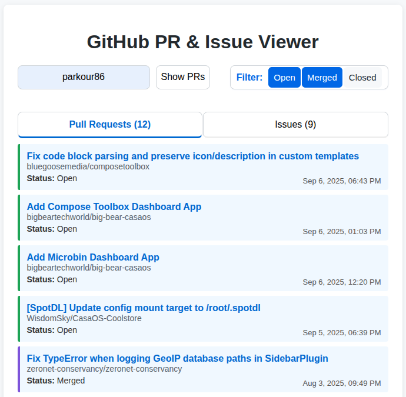
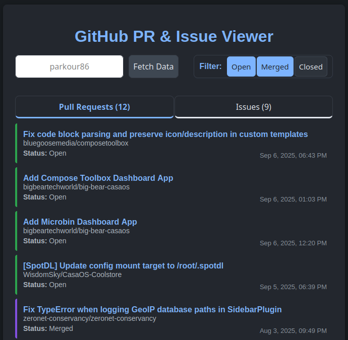

# GitHub PR & Issue Viewer

A simple web app to view and filter GitHub pull requests and issues by user, with tabbed navigation and status filters.

## Demo

[Live Demo](https://parkour86.github.io/github-pr-issue-viewer/)

## Features

- **View Pull Requests and Issues:**
  Enter any GitHub username to see their recent pull requests and issues across all repositories.

- **Tabbed Navigation:**
  Switch easily between Pull Requests and Issues.

- **Status Filtering:**
  Filter by Open, Closed, and (for PRs) Merged status.

- **Responsive UI:**
  Clean, modern interface built with HTML, CSS, and jQuery.

## Usage

1. **Clone or Download this Repository**

2. **Open `index.html` in your browser**

3. **Enter a GitHub username** in the input box and click "Show PRs"
   - Use the tabs to switch between Pull Requests and Issues.
   - Use the filter buttons to show/hide items by status.

## Screenshot

 

## How It Works

- Fetches issues and pull requests from the GitHub Search API for the specified user.
- Displays results in a tabbed, filterable list.
- No backend required; runs entirely in the browser.

## Requirements

- Modern web browser
- Internet connection (to access GitHub API and jQuery CDN)

## Customization

- All styling is in `styles.css`
- Main logic is in `scripts.js`

## License

MIT License

---
